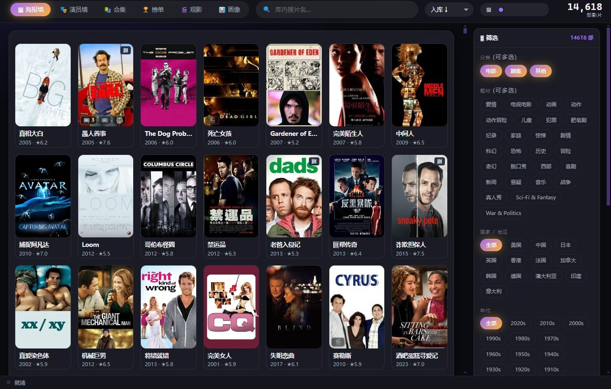
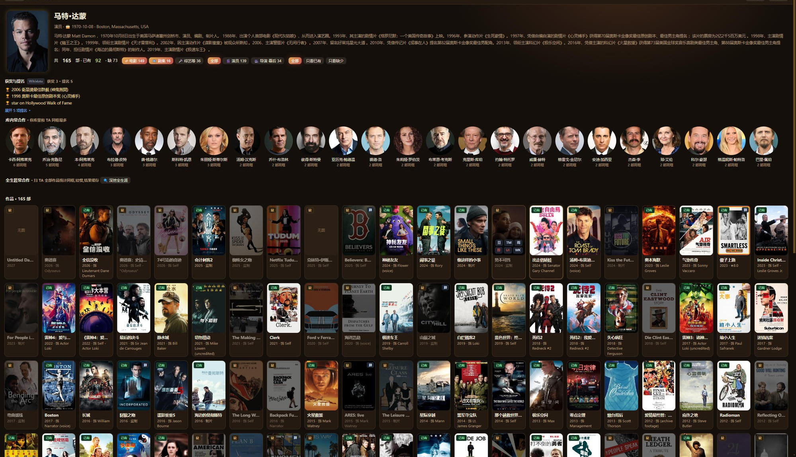
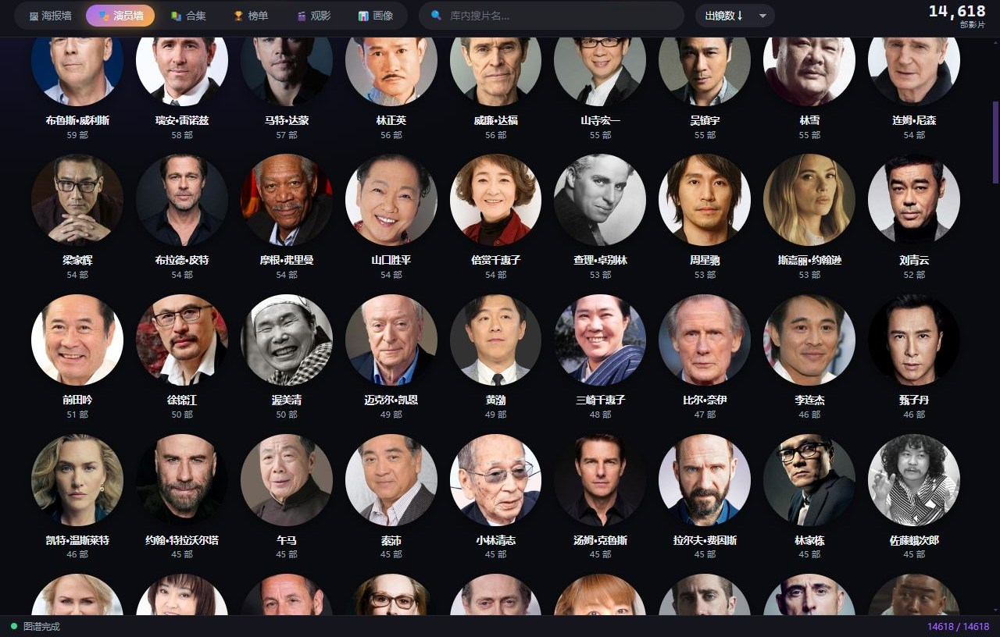
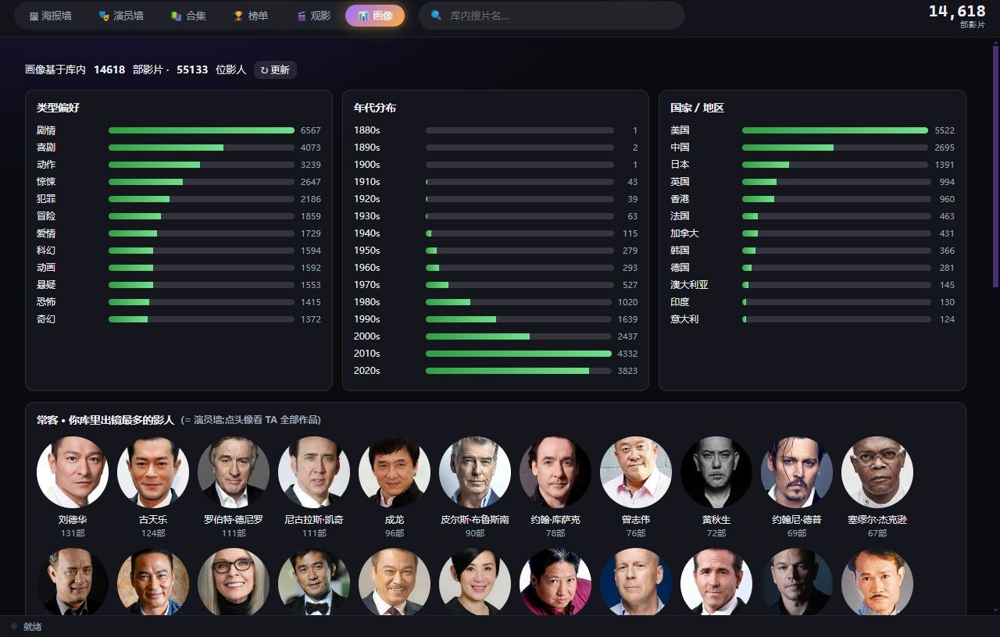
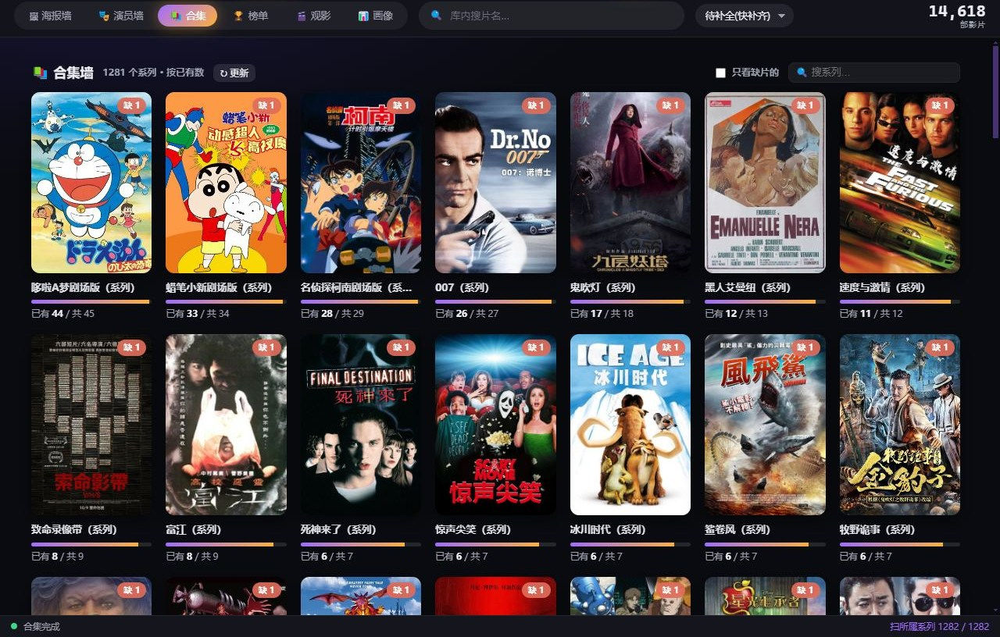
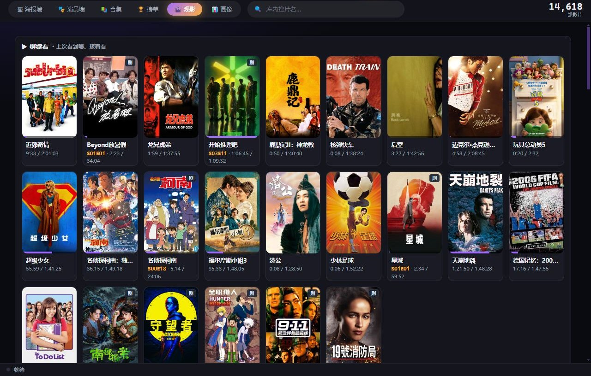

# 🎬 西天电影会 · CINEHALL

### 整理你自己的电影收藏,发现整个电影世界

把散落在硬盘 / NAS / 网盘里的自有影片,一键理成一座会动的海报墙。 
自动识别刮削、演员画像、系列合集、查漏补缺 —— 像策展人一样收纳你的电影,像上课一样读懂影史。

**[🌐 访问官网 · 免费下载](https://lifeisshortplaymore.com)** &nbsp;|&nbsp; **[⬇ 最新便携版 Releases](../../releases/latest)**

Windows / macOS · 绿色免安装 · 数据全在本地 · 工具只整理你自己已有的影片,不提供任何影片 / 片源

---

## 📖 这是什么

很多影迷都有同一个烦恼:攒了几百上千部电影,散落在硬盘、移动盘、NAS、网盘里 —— 文件名乱七八糟、没有封面、哪部看过哪部没看全靠脑子记、想找一部翻半天、甚至重复下载了都不知道。

**西天电影会**就是专门解决这个问题的桌面工具。它做两件事:

1. **整理**:把你已有的影片,自动识别、刮削元数据、生成封面,理成一座漂亮、好搜、好逛的海报墙,像整理相册一样收纳你的收藏。
2. **发现**:再用演员、系列、合集、榜单,把整个电影世界的片单铺在你面前 —— 一眼看清自己**收了什么、还缺什么**,顺着影史与奖项一路补下去,像一堂看不完的私人电影课。

> 它不是看片软件、也不提供任何影片或片源;它是帮你把**自己已经拥有**的电影,整理好、看明白的工具。

---

## ✨ 核心功能详解

### 🖼 会动的海报墙影库

- **万部规模不卡顿**:瀑布流呈现整库影片,虚拟滚动技术让上万部的库也能顺滑滑动。
- **秒级检索**:库内搜片名即时出结果;支持按**分类**(电影 / 剧集 / 其他)、**题材**(爱情 / 动作 / 科幻 / 悬疑…)、**国家地区**、**年代**多维筛选,层层组合快速定位。
- **多种排序**:按入库时间、评分、年份等排序,想怎么逛就怎么逛。
- **电影 + 剧集混合**:剧集自动标集数,和电影同库共存、统一管理。
- **主题皮肤**:内置霓虹 / 玻璃 / 胶片等多套配色,海报墙也能换心情。

### 🤖 AI 智能识别与刮削

- **文件名再乱也能认**:`[电影天堂]阿凡达.2009.1080p.BluRay.x264` 这种乱名,也能准确认出是哪部。
- **一键补全元数据**:自动匹配 TMDB 的海报、简介、评分、上映年份、类型、导演与演职员表,空荡荡的文件夹瞬间变成图文并茂的收藏。
- **批量 + 单片两种模式**:整库批量归档,也能对个别影片手动单片识别、纠正匹配。
- **识别历史可还原**:每次识别 / 归档都有记录,认错了、归档错了,一键还原回上一步,不怕误操作。

### 👤 演员墙与生涯画像

这是收藏党最爱的功能。点开任意一位演员,一整页给你铺开:

- **生平与档案**:生日、出生地、简介,以及 Ta 的**获奖与提名**记录。
- **库内常合作**:统计出「谁和 Ta 同框最多」,一眼看清你库里的班底关系。
- **全部作品 + 已有 / 缺标记**:Ta 参演的**每一部**都列出来,并标好哪些你**已有**、哪些**还缺** —— 照单补片、收藏不漏一部。
- **深挖全生涯**:一键扫 Ta 的全部作品做同框统计,把演员之间的合作网络摸透。

**演员墙**把你库里出现过的影人聚合成一面墙,按作品数、合作度浏览;**演员画像**则聚焦单个影人的深度资料。

| 演员墙 | 演员画像 |
|:---:|:---:|
|  |  |

### 🗂 合集 · 榜单 · 影史脉络

- **系列自动成集**:同一系列(漫威、指环王、007…)自动归成合集,一套齐不齐一目了然。
- **内置榜单配方**:内置奥斯卡、各大奖项与经典榜单的配方,像策展人一样按主题编排你的片库。
- **查漏补缺**:合集 / 榜单里缺哪部清清楚楚,顺着片单把一个系列、一段影史补完整。

### 🎞 内嵌高清播放

- **mpv 内核硬解**:内置专业播放内核,4K 硬件解码流畅播放,整理好双击即看,不用再单独开播放器。
- **字幕 / 音轨 / 剧集一键切换**:多字幕、多音轨、剧集选集,播放时随手切换。
- **控制条皮肤**:播放器控制条支持自定义皮肤。
- **会动的海报墙**:多部影片可同屏播放,拼成一面流动的光影展厅。
- **记忆续播**:记住上次看到哪,下次接着看。

### 🅰 AI 字幕

- **本地生成字幕**:内置 Whisper 引擎,在本地为没有字幕的影片**自动生成字幕**,不联网、不上传。
- **双语翻译**:可把字幕翻译成中英双语,外语片也能舒服看。

### 📱 手机 / 平板也能看(局域网 Web)

- **浏览器直接看片库**:开启局域网访问后,手机 / 平板 / 另一台电脑用浏览器就能浏览你的海报墙、搜片、看详情。
- **一套界面**:手机端和桌面端是同一套界面的自适应,操作一致。
- **可添加到主屏**:支持以 PWA 方式「添加到主屏幕」,像个 App 一样打开。
- **交给手机播放器**:也能把影片直链甩给手机上的播放器(VLC 等)播放。

### 🗄 多种片源位置

影片放在哪都能整理:**本地硬盘 / 移动盘 / NAS / WebDAV / 主流网盘**都支持,不必先把几 TB 的库搬来搬去。

### 🔒 绿色 · 本地优先 · 隐私

- **绿色免安装**:解压双击即用,不写系统、不留残留。
- **数据全在本地**:所有配置、缓存、影库索引都写在程序文件夹里,**不注册账号、不上传云端**。
- **拷走即用**:整个文件夹复制到别的电脑或移动硬盘,打开还是原来的样子。

---

## 🆚 免费版 vs Pro

| 功能 | 免费版 | Pro 买断 |
|---|:---:|:---:|
| 海报墙浏览 · 搜索筛选 | ✓ | ✓ |
| 内嵌高清播放(4K 硬解) | ✓ | ✓ |
| 基础识别 · 手动归档 | ✓ | ✓ |
| 库容上限 | 500 部 | **无限** |
| AI 智能识别 · 批量归档 | — | ✓ |
| 演员墙 · 生涯画像 | — | ✓ |
| 合集 · 榜单 · 影史 | — | ✓ |
| AI 字幕(Whisper) | — | ✓ |
| 手机 / 平板局域网访问 | — | ✓ |
| 深度合作分析 | — | ✓ |

> 免费版永久可用,先用后买;Pro 一次买断、后续更新免费。价格与购买见[官网](https://lifeisshortplaymore.com)。

---

## 🚀 快速开始

1. 到 [Releases](../../releases/latest) 或[官网](https://lifeisshortplaymore.com)下载 Windows 便携版,解压。
2. 双击 `CineHall.exe`(macOS 见官网说明)。首次打开若弹「未知发布者」提示,点「更多信息 → 仍要运行」即可(绿色软件、已签名)。
3. 按首次配置引导:填入一个**免费的 TMDB API Key**(用于刮削海报和资料),并指定你的**片库位置**(本地文件夹 / NAS / 网盘)。
4. 让它扫描识别,几分钟后你的海报墙就成型了。开逛吧。

---

## ⬇ 下载

- **官网(推荐,含免费版 + 图文说明 + 常见问题)**:**<https://lifeisshortplaymore.com>**
- **GitHub Releases**:[最新便携版](../../releases/latest)(Windows,解压双击即用,免安装)。
- **国内网盘**:见官网下载区。

## 💻 系统要求

- **Windows** 10 / 11(64 位),或 **macOS**。
- 一个**免费的 TMDB API Key**(用于刮削元数据,官网引导里有申请方法)。
- 你自己的影片(本地 / NAS / 网盘皆可)。

---

## ❓ 常见问题

**Q:影片从哪来?需要我自己有片吗?** 
是的。本软件**只整理你自己已经拥有的影片**,不提供、不含任何影片或片源。它是整理编目 + 播放的工具。

**Q:会上传我的数据到云端吗?** 
不会。纯本地运行,数据全在你自己电脑的程序文件夹里,不注册账号、不上传。

**Q:为什么要 TMDB Key?** 
海报、简介、评分、演职员这些资料来自 TMDB(权威的影视数据库)。你自备一个**免费**的 API Key 即可,一次配置长期使用。

**Q:支持剧集吗?支持哪些格式?** 
支持电影 + 剧集混合库;内核为 mpv,主流视频格式与 4K 硬解都没问题。

**Q:Mac 能用吗?** 
能。提供 Windows / macOS 版本(macOS 安装说明见官网)。

**Q:是开源的吗?** 
目前以便携版形式分发,本仓库仅用于下载,不含源代码。

---

## 了解更多 · 免费下载

### → [lifeisshortplaymore.com](https://lifeisshortplaymore.com)

© 玩物丧志软件 WANWU LAB · 个人开发者作品,长期更新维护。 
工具只整理你自己已有的影片,本身不含任何影视内容 / 片源。本仓库仅用于分发便携版下载,不含源代码。

